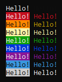

# Palette.h

Palette.h is a lightweight C++ library designed to simplify printing text with multiple colors on the console. With Palette.h, developers can easily enhance the visual presentation of their command-line applications by adding colors to text output. This library provides a straightforward interface for specifying colors, making it simple to incorporate vibrant and readable console output into any C++ project. 

### Output:

***
**Author: OrbitX.Space**
